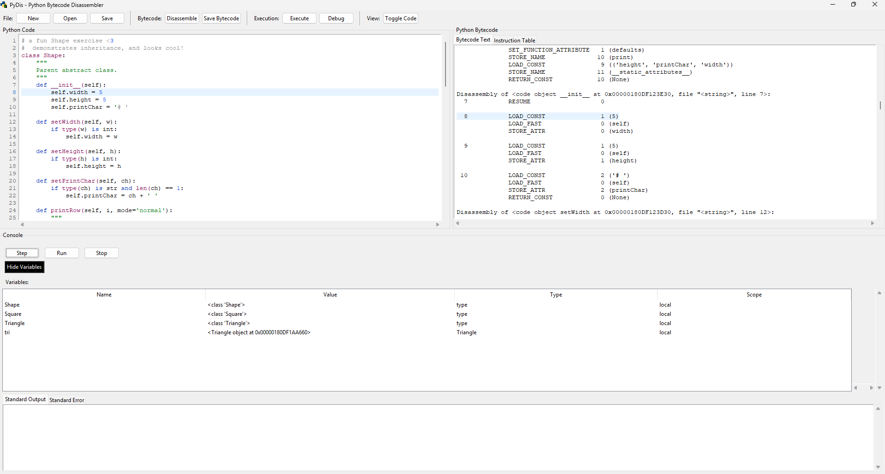

# PyDis - Python Bytecode Disassembler

A GUI-based educational tool for disassembling Python code into bytecode, exploring its structure, and understanding Python's internal execution mechanisms.

## Overview

PyDis is a desktop application that allows for the disassembly of Python code (entire files or snippets) using Python's built-in `dis` module. It provides a clean, intuitive interface for viewing and understanding Python bytecode while offering features for step-by-step execution, variable inspection, and I/O handling.

## Features

- **Code Input**: Paste Python code snippets or load entire Python files
- **Bytecode Disassembly**: Convert Python code into its bytecode representation
- **Dual View**: See both Python source code and corresponding bytecode side-by-side
- **Step-by-step Execution**: Execute code one step at a time to observe changes
- **Variable Inspection**: Monitor variable values during execution
- **I/O Handling**: Capture and display standard output and error streams
- **Bytecode Export**: Save disassembled bytecode in various formats (text, binary, JSON, markdown report)

## Screenshot



## Installation

PyDis requires Python 3.8 or higher and uses the Tkinter GUI library which is included in standard Python distributions.

### Setup

#### Command-Line Launch
1. Clone this repository:
   ```
   git clone https://github.com/yourusername/pydis.git
   cd pydis
   ```

2. Run the application:
   ```
   python pydis.py
   ```

#### Executable Launch
1. Download the PyDis application executable [here](./dist/pydis.exe)

2. Place it wherever you prefer

3. Double-click to launch, or via your preferred method

## Usage

1. **New/Open File**: Start with a new file or open an existing Python file
2. **Write or Edit Code**: Use the code editor to write or modify Python code
3. **Disassemble**: Click the "Disassemble" button to convert the code to bytecode
4. **Execute or Debug**: Run the code normally or step through it with the debugger
5. **Examine Bytecode**: View the generated bytecode in text or table format
6. **Save Results**: Save your Python code or export the bytecode in various formats

## Key Shortcuts

- **Ctrl+N**: New file
- **Ctrl+O**: Open file
- **Ctrl+S**: Save file
- **F5**: Execute code
- **F9**: Disassemble code
- **F10**: Debug (step-by-step execution)

## Educational Use

PyDis is designed as a teaching tool for Python internals and can be used to:

- Demonstrate how Python code is translated to bytecode
- Explain Python's execution model
- Visualize program flow at the bytecode level
- Compare different code constructs and their bytecode efficiency
- Introduce concepts of virtual machines and bytecode interpretation

## Project Structure

```
pydis/
├── main.py                  # Application entry point
├── requirements.txt         # Dependencies
├── README.md                # Documentation
├── src/
│   ├── __init__.py
│   ├── core/                # Core functionality
│   │   ├── __init__.py
│   │   ├── disassembler.py  # Bytecode disassembly logic
│   │   ├── executor.py      # Code execution engine
│   │   └── file_handler.py  # File I/O operations
│   ├── gui/                 # GUI components
│   │   ├── __init__.py
│   │   ├── app.py           # Main application window
│   │   ├── code_view.py     # Code editor/display component
│   │   ├── bytecode_view.py # Bytecode display component
│   │   ├── toolbar.py       # Application toolbar
│   │   └── debugger.py      # Step-by-step execution UI
│   └── utils/               # Utility functions
│       ├── __init__.py
│       ├── config.py        # Configuration settings
│       └── theme.py         # UI theming utilities
└── tests/                   # Unit tests
    ├── __init__.py
    ├── test_disassembler.py
    └── test_executor.py
```

## Contributing

Contributions are welcome! Please feel free to submit a Pull Request.

## License

This project is licensed under the MIT License - see the LICENSE file for details.

## Acknowledgments

- This project was inspired by the need for better educational tools for teaching Python bytecode concepts
- Thanks to Python's `dis` module for making bytecode disassembly accessible programmatically
