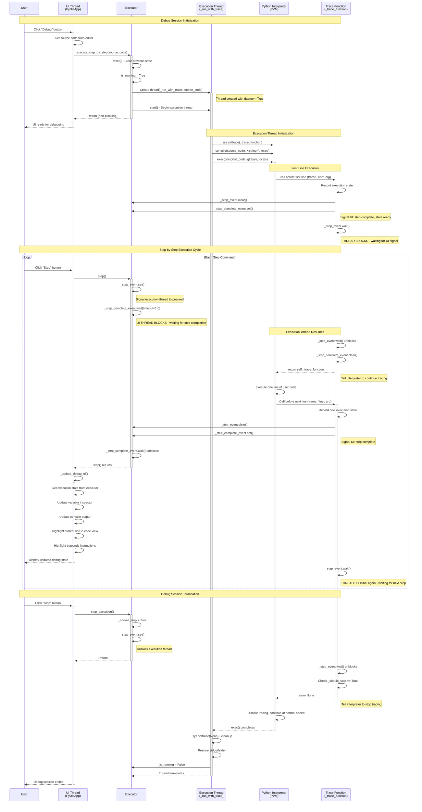

# PyDis - Python Bytecode Disassembler

A GUI-based educational tool for disassembling Python code into bytecode, exploring its structure, and understanding Python's internal execution mechanisms.

## Overview

PyDis is a desktop application that allows for the disassembly of Python code (entire files or snippets) using Python's built-in `dis` module. It provides a clean, intuitive interface for viewing and understanding Python bytecode while offering features for step-by-step execution, variable inspection, and I/O handling.

## Features

- **Code Input**: Paste Python code snippets or load entire Python files
- **Bytecode Disassembly**: Convert Python code into its bytecode representation
- **Dual View**: See both Python source code and corresponding bytecode side-by-side
- **Step-by-step Execution**: Execute code one step at a time to observe changes
- **Variable Inspection**: Monitor variable values during execution
- **I/O Handling**: Capture and display standard output and error streams
- **Bytecode Export**: Save disassembled bytecode in various formats (text, binary, JSON, markdown report)

## Screenshot


## Installation

PyDis requires Python 3.8 or higher and uses the Tkinter GUI library which is included in standard Python distributions.

### Option 1: Download Executable (Recommended for Users)

**[📥 Download PyDis v1.0 - Windows Executable](https://github.com/dylantcon/pydis/releases/latest/download/pydis.exe)**

1. Click the download link above
2. Save the `pydis.exe` file to your desired location
3. Double-click to launch PyDis
4. No Python installation required!

*Note: The executable is built for Windows. For other platforms, use the source code installation below.*

### Option 2: Run from Source Code

#### Command-Line Launch
1. Clone this repository:
    ```bash
    git clone https://github.com/yourusername/pydis.git
    cd pydis
    ```

2. Run the application:
    ```bash
    python pydis.py
    ```

#### Building Your Own Executable
If you want to build the executable yourself:

1. Install PyInstaller:
    ```bash
    pip install pyinstaller
    ```

2. Build the executable:
    ```bash
    pyinstaller pydis.spec
    ```

3. Find the executable in the `dist/` folder

## System Requirements

- **For Executable**: Windows 10 or later (no additional requirements)
- **For Source**: Python 3.8+ with Tkinter (included in most Python distributions)
- **Memory**: Minimum 4GB RAM recommended for analyzing large Python files
- **Storage**: ~11MB for executable, +50MB for source

## Usage

1. **New/Open File**: Start with a new file or open an existing Python file
2. **Write or Edit Code**: Use the code editor to write or modify Python code
3. **Disassemble**: Click the "Disassemble" button to convert the code to bytecode
4. **Execute or Debug**: Run the code normally or step through it with the debugger
5. **Examine Bytecode**: View the generated bytecode in text or table format
6. **Save Results**: Save your Python code or export the bytecode in various formats

## Key Shortcuts

- **Ctrl+N**: New file
- **Ctrl+O**: Open file
- **Ctrl+S**: Save file
- **F5**: Execute code
- **F9**: Disassemble code
- **F10**: Debug (step-by-step execution)

## Educational Use

PyDis is designed as a teaching tool for Python internals and can be used to:

- Demonstrate how Python code is translated to bytecode
- Explain Python's execution model
- Visualize program flow at the bytecode level
- Compare different code constructs and their bytecode efficiency
- Introduce concepts of virtual machines and bytecode interpretation

## Project Structure

```
pydis/
├── main.py                  # Application entry point
├── requirements.txt         # Dependencies
├── README.md                # Documentation
├── src/
│   ├── __init__.py
│   ├── core/                # Core functionality
│   │   ├── __init__.py
│   │   ├── disassembler.py  # Bytecode disassembly logic
│   │   ├── executor.py      # Code execution engine
│   │   └── file_handler.py  # File I/O operations
│   ├── gui/                 # GUI components
│   │   ├── __init__.py
│   │   ├── app.py           # Main application window
│   │   ├── code_view.py     # Code editor/display component
│   │   ├── bytecode_view.py # Bytecode display component
│   │   ├── toolbar.py       # Application toolbar
│   │   └── debugger.py      # Step-by-step execution UI
│   └── utils/               # Utility functions
│       ├── __init__.py
│       └── resources.py        # Resource management
└
```

### Debugger Sequence Diagram



## Contributing

Contributions are welcome! Please feel free to submit a Pull Request.

## License

This project is licensed under the MIT License - see the LICENSE file for details.

## Acknowledgments

- This project was inspired by the need for better educational tools for teaching Python bytecode concepts
- Thanks to Python's `dis` module for making bytecode disassembly accessible programmatically
